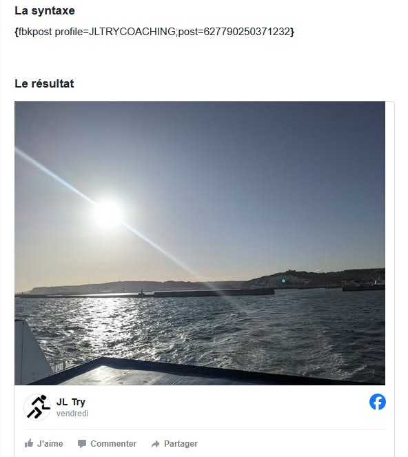

# com_jofacebook 1.0.0

## Quick Start

Download <a href="https://github.com/JLTRY/jofacebook/releases/latest" target="_blank">latest version</a> of package

## Requirements

Joomla 5.0+ 

## Features

The package includes a component (helper), and 2 plugins
- component_jofacebook
- content/jofbkpost : a plugin to be able to add Facebook posts in an article
- editors-xtd/jofbkpost : an helper plugin in editor to insert the correct tags for 1st plugin

## Example

## 2025-08-18 version 1.0.0

Initial version
